# 🚀 GitOps Three-Tier Todo Application - DevSecOps CI Pipeline

<div align="center">


**A Production-Grade DevSecOps CI/CD Pipeline with 23 Security Stages**

[Features](#-key-features) • [Architecture](#%EF%B8%8F-architecture) • [Getting Started](#-getting-started) • [Pipeline Stages](#-pipeline-stages-23-stages) • [Screenshots](#-application-screenshots)

</div>

---

## 📋 Table of Contents

- [Overview](#-overview)
- [Architecture](#%EF%B8%8F-architecture)
- [Key Features](#-key-features)
- [Tech Stack](#-tech-stack)
- [Prerequisites](#-prerequisites)
- [Installation Guide](#-installation-guide)
- [Pipeline Stages](#-pipeline-stages-23-stages)
- [Security Implementation](#-security-features-implemented)
- [Project Structure](#-project-structure)
- [Screenshots](#-application-screenshots)
- [Troubleshooting](#-troubleshooting)
- [Contributing](#-contributing)

---

## 🎯 Overview

This project demonstrates a **complete end-to-end DevSecOps CI pipeline** for a Three-Tier Todo Application deployed on **AWS EKS** with **Application Load Balancer (ALB)** Ingress Controller and **ArgoCD** for GitOps-based continuous deployment.

### What Makes This Pipeline Special?

✅ **23 Automated Stages** - From code checkout to production deployment  
✅ **Multiple Security Layers** - TruffleHog, Snyk, SonarQube, OWASP, Dockle, ZAP  
✅ **GitOps Workflow** - ArgoCD with automated image updates  
✅ **Cloud-Native** - Kubernetes on AWS EKS with ALB  
✅ **Production-Ready** - High availability, auto-scaling, monitoring  
✅ **Fully Documented** - Step-by-step implementation guide

---

## 🏗️ Architecture

### Three-Tier Application Architecture

```
┌──────────────────────────────────────────────────────────┐
│              Internet (Public Access)                     │
└────────────────────────┬─────────────────────────────────┘
                         │
                  ┌──────▼──────┐
                  │   AWS ALB   │
                  │   Ingress   │
                  └──────┬──────┘
                         │
          ┌──────────────┴──────────────┐
          │                             │
    ┌─────▼─────┐               ┌──────▼──────┐
    │ Frontend  │               │   Backend   │
    │  (React)  │──────────────▶│(Spring Boot)│
    │   Pods    │    REST API   │    Pods     │
    └───────────┘               └──────┬──────┘
                                       │
                                ┌──────▼──────┐
                                │   MySQL     │
                                │  Database   │
                                └─────────────┘
```

### DevSecOps Pipeline Flow

<p align="center">
    
</p>

```
┌──────────┐    ┌──────────┐    ┌──────────┐    ┌──────────┐    ┌──────────┐
│   Git    │───▶│ Jenkins  │───▶│  Docker  │───▶│ ArgoCD   │───▶│   EKS    │
│  Commit  │    │ Pipeline │    │   Hub    │    │ GitOps   │    │ Cluster  │
└──────────┘    └──────────┘    └──────────┘    └──────────┘    └──────────┘
      │              │                 │               │               │
      │         [Security Scans]  [Container]    [Auto Sync]    [ALB Ingress]
      │         • TruffleHog     • Dockle        • Image        • Health
      │         • Snyk           • Push          • Updater      • Checks
      │         • SonarQube
      │         • OWASP
      │         • ZAP
```

---

## ✨ Key Features

### 🔐 DevSecOps Security

- **Secret Scanning** - TruffleHog detects hardcoded secrets in Git history
- **Dependency Analysis** - Snyk + OWASP for vulnerable package detection
- **Code Quality** - SonarQube SAST with Quality Gates
- **Container Security** - Dockle for Docker image best practices
- **Runtime Security** - OWASP ZAP for DAST testing
- **Compliance** - Full audit trails and artifact traceability

### ⚙️ DevOps Best Practices

- **CI/CD Automation** - 23-stage fully automated pipeline
- **GitOps** - ArgoCD with automatic image updates
- **Infrastructure as Code** - Kubernetes manifests version controlled
- **Containerization** - Multi-stage Docker builds
- **Cloud-Native** - AWS EKS with ALB Ingress Controller

### 🚀 Production Features

- **High Availability** - Multi-replica deployments
- **Auto-Scaling** - Kubernetes HPA ready
- **Load Balancing** - AWS ALB with health checks
- **Monitoring** - Comprehensive logging and observability
- **RBAC** - Kubernetes role-based access control

---

## 🛠️ Tech Stack

### Application Layer

| Component      | Technology  | Version | Purpose               |
| -------------- | ----------- | ------- | --------------------- |
| **Frontend**   | React.js    | Latest  | User Interface        |
| **Backend**    | Spring Boot | 3.x     | REST API              |
| **Database**   | MySQL       | 8.0     | Data Persistence      |
| **Runtime**    | Node.js     | 23.8    | Frontend Build        |
| **Runtime**    | JDK         | 17.0    | Backend Compilation   |
| **Build Tool** | Maven       | 3.9     | Dependency Management |

### DevOps & Infrastructure

| Component         | Technology     | Version | Purpose                |
| ----------------- | -------------- | ------- | ---------------------- |
| **CI/CD**         | Jenkins        | 2.x     | Pipeline Orchestration |
| **VCS**           | Git/GitHub     | -       | Version Control        |
| **Container**     | Docker         | Latest  | Containerization       |
| **Registry**      | Docker Hub     | -       | Image Storage (17rj)   |
| **Orchestration** | AWS EKS        | 1.28+   | Kubernetes Cluster     |
| **Ingress**       | ALB Controller | 2.7+    | Load Balancer          |
| **GitOps**        | ArgoCD         | 2.9+    | Continuous Deployment  |
| **Artifacts**     | Nexus          | 3.x     | Artifact Repository    |

### Security Tools (DevSecOps)

| Tool                       | Category           | Purpose                              |
| -------------------------- | ------------------ | ------------------------------------ |
| **TruffleHog**             | Secret Scanning    | Detect leaked credentials            |
| **Snyk**                   | SCA                | Software Composition Analysis        |
| **SonarQube**              | SAST               | Static Application Security Testing  |
| **OWASP Dependency Check** | CVE                | Known vulnerability detection        |
| **Dockle**                 | Container Security | Docker image linting                 |
| **OWASP ZAP**              | DAST               | Dynamic Application Security Testing |

---

## 📋 Prerequisites

Before starting, ensure you have the following:

### 1. AWS Infrastructure

#### EKS Cluster Setup

```yaml
Cluster Configuration:
  Name: expdevops-cluster
  Region: ap-south-1 (Mumbai)
  Kubernetes Version: 1.28+
  Node Type: t3.medium (minimum)
  Node Count: 2-3 worker nodes
  VPC: Custom VPC with public/private subnets
```

**📌 Important:** Follow the [EKS Setup Guide](#eks-cluster-setup) below to create your cluster.

#### ALB Ingress Controller

```yaml
Requirements:
  - AWS Load Balancer Controller v2.7.0+
  - IAM OIDC Provider enabled
  - Service Account: aws-load-balancer-controller
  - Namespace: kube-system
```

**📌 Important:** ALB Controller must be installed. See [ALB Installation](#alb-controller-installation) section.

#### ArgoCD Setup

```yaml
Requirements:
  - ArgoCD installed in argocd namespace
  - ArgoCD CLI configured
  - Git repository access configured
```

**📌 Important:** Follow [ArgoCD Installation](#argocd-installation) guide below.

### 2. Jenkins Server

#### System Requirements

```
- OS: Ubuntu 20.04+ / Amazon Linux 2
- RAM: 16GB minimum
- CPU: 8 cores
- Disk: 50GB
- Docker installed
- kubectl installed
```

#### Required Jenkins Plugins

Install these plugins via **Manage Jenkins → Plugins → Available Plugins**:

```
✓ Pipeline
✓ Git Plugin
✓ Docker Pipeline
✓ Docker Plugin
✓ Kubernetes CLI Plugin
✓ SonarQube Scanner
✓ OWASP Dependency-Check
✓ Config File Provider
✓ Snyk Security Plugin
✓ Credentials Plugin
✓ Credentials Binding
✓ Pipeline Stage View
✓ Blue Ocean (Optional)
✓ HTML Publisher
✓ JaCoCo Plugin
✓ Warnings Next Generation
```

#### Tool Configuration

Navigate to **Jenkins → Manage Jenkins → Global Tool Configuration**:

```groovy
JDK Configuration:
  Name: jdk-17.0
  ☑ Install automatically
  Version: JDK 17.0.10

Maven Configuration:
  Name: maven-3.9
  ☑ Install automatically
  Version: 3.9.6

NodeJS Configuration:
  Name: nodejs-23.8
  ☑ Install automatically
  Version: 23.8.0

SonarQube Scanner:
  Name: sonar-scanner
  ☑ Install automatically
  Version: Latest (SonarQube Scanner 5.0+)

OWASP Dependency-Check:
  Name: owasp
  ☑ Install automatically
  Version: Latest
```

### 3. Required Credentials in Jenkins

Go to **Jenkins → Manage Jenkins → Credentials → System → Global credentials**

| Credential ID    | Type              | Description        | How to Create                                                          |
| ---------------- | ----------------- | ------------------ | ---------------------------------------------------------------------- |
| `docker-cred`    | Username/Password | Docker Hub login   | Username: `17rj`<br>Password: Your Docker Hub token                    |
| `kube-cred`      | Secret file       | Kubernetes config  | Upload your `~/.kube/config` file                                      |
| `sonar-cred`     | Secret text       | SonarQube token    | Generate from SonarQube → My Account → Security                        |
| `snyk-cred`      | Secret text       | Snyk API token     | Get from Snyk → Account Settings → API Token                           |
| `nvd-api-key`    | Secret text       | NVD API key        | Get from [NVD API](https://nvd.nist.gov/developers/request-an-api-key) |
| `nexus-settings` | Managed file      | Maven settings.xml | Upload your Nexus `settings.xml`                                       |

### 4. External Services

#### SonarQube Server

```yaml
Setup Required:
  URL: http://your-sonarqube-server:9000
  Project Key: devsecopsthreetier
  Quality Gate: Configured (default is fine)
  Webhook: http://jenkins-url/sonarqube-webhook/
```

**How to Setup:**

1. Install SonarQube (Docker recommended)
2. Create project with key `devsecopsthreetier`
3. Generate authentication token
4. Configure in Jenkins: **Manage Jenkins → Configure System → SonarQube servers**

#### Nexus Repository

```yaml
Setup Required:
  URL: http://your-nexus-server:8081
  Repository: maven-releases
  Authentication: Admin credentials
```

**Maven settings.xml example:**

```xml
<settings>
  <servers>
    <server>
      <id>nexus</id>
      <username>admin</username>
      <password>your-password</password>
    </server>
  </servers>
</settings>
```

### 5. Security Tools Installation

Install these tools on your **Jenkins server**:

```bash
# Update system
sudo apt update && sudo apt upgrade -y

# Install Python & pip
sudo apt install python3 python3-pip -y

# Install TruffleHog
pip3 install trufflehog

# Install Node.js & npm (if not using Jenkins tool)
curl -fsSL https://deb.nodesource.com/setup_20.x | sudo -E bash -
sudo apt install -y nodejs

# Install Snyk CLI
sudo npm install -g snyk

# Install Dockle
VERSION=$(curl --silent "https://api.github.com/repos/goodwithtech/dockle/releases/latest" | grep '"tag_name":' | sed -E 's/.*"v([^"]+)".*/\1/')
wget https://github.com/goodwithtech/dockle/releases/download/v${VERSION}/dockle_${VERSION}_Linux-64bit.tar.gz
tar zxvf dockle_${VERSION}_Linux-64bit.tar.gz
sudo mv dockle /usr/local/bin/
rm dockle_${VERSION}_Linux-64bit.tar.gz

# Install Docker (if not already installed)
sudo apt install docker.io -y
sudo systemctl start docker
sudo systemctl enable docker
sudo usermod -aG docker $USER
sudo usermod -aG docker jenkins

# Install kubectl
curl -LO "https://dl.k8s.io/release/$(curl -L -s https://dl.k8s.io/release/stable.txt)/bin/linux/amd64/kubectl"
sudo install -o root -g root -m 0755 kubectl /usr/local/bin/kubectl

# Install Helm
curl https://raw.githubusercontent.com/helm/helm/main/scripts/get-helm-3 | bash

# Verify installations
trufflehog --version
snyk --version
dockle --version
docker --version
kubectl version --client
helm version
```

### 6. Docker Hub Account

```yaml
Required:
  - Docker Hub account created
  - Username: 17rj (or your username)
  - Repositories:
    * three-tier-todo-frontend
    * three-tier-todo-backend
```

**Create repositories:**

```bash
# Login to Docker Hub
docker login

# Or create via web: https://hub.docker.com/repository/create
```

---

## 🚀 Installation Guide

### Step 1: EKS Cluster Setup

#### Option A: Using Terraform (Recommended)

```bash
# Clone Terraform repository
git clone https://github.com/17J/Terraform-AWS-EKS.git
cd Terraform-AWS-EKS/terraform/

# Initialize Terraform
terraform init

# Review the planned changes
terraform plan

# Apply configuration
terraform apply -auto-approve

# Configure kubectl
aws eks update-kubeconfig --region ap-south-1 --name expdevops-cluster

# Verify cluster
kubectl get nodes
```

#### Option B: Using eksctl

```bash
# Install eksctl
curl --silent --location "https://github.com/weaveworks/eksctl/releases/latest/download/eksctl_$(uname -s)_amd64.tar.gz" | tar xz -C /tmp
sudo mv /tmp/eksctl /usr/local/bin

# Create cluster
eksctl create cluster \
  --name expdevops-cluster \
  --region ap-south-1 \
  --nodegroup-name standard-workers \
  --node-type t3.medium \
  --nodes 3 \
  --nodes-min 2 \
  --nodes-max 4 \
  --managed

# Verify
kubectl get nodes
```

### Step 2: ALB Controller Installation

```bash
# 1. Associate OIDC provider with cluster
eksctl utils associate-iam-oidc-provider \
  --region ap-south-1 \
  --cluster expdevops-cluster \
  --approve

# 2. Download IAM policy
curl -o iam_policy.json https://raw.githubusercontent.com/kubernetes-sigs/aws-load-balancer-controller/v2.7.0/docs/install/iam_policy.json

# 3. Create IAM policy
aws iam create-policy \
  --policy-name AWSLoadBalancerControllerIAMPolicy \
  --policy-document file://iam_policy.json

# 4. Create service account (Replace YOUR_ACCOUNT_ID)
eksctl create iamserviceaccount \
  --cluster=expdevops-cluster \
  --namespace=kube-system \
  --name=aws-load-balancer-controller \
  --attach-policy-arn=arn:aws:iam::YOUR_ACCOUNT_ID:policy/AWSLoadBalancerControllerIAMPolicy \
  --override-existing-serviceaccounts \
  --approve

# 5. Add Helm repository
helm repo add eks https://aws.github.io/eks-charts
helm repo update

# 6. Install ALB Controller
helm install aws-load-balancer-controller eks/aws-load-balancer-controller \
  -n kube-system \
  --set clusterName=expdevops-cluster \
  --set serviceAccount.create=false \
  --set serviceAccount.name=aws-load-balancer-controller

# 7. Verify installation
kubectl get deployment -n kube-system aws-load-balancer-controller
kubectl logs -n kube-system deployment/aws-load-balancer-controller
```

### Step 3: ArgoCD Installation

```bash
# 1. Create ArgoCD namespace
kubectl create namespace argocd

# 2. Install ArgoCD
kubectl apply -n argocd -f https://raw.githubusercontent.com/argoproj/argo-cd/stable/manifests/install.yaml

# 3. Wait for pods to be ready
kubectl wait --for=condition=Ready pods --all -n argocd --timeout=300s

# 4. Get initial admin password
kubectl -n argocd get secret argocd-initial-admin-secret -o jsonpath="{.data.password}" | base64 -d

# 5. Port forward to access UI (Optional)
kubectl port-forward svc/argocd-server -n argocd 8080:443

# 6. Login via CLI
argocd login localhost:8080 --username admin --password <password-from-step-4>

# 7. Change admin password
argocd account update-password
```

### Step 4: ArgoCD Image Updater Installation

```bash
# 1. Install ArgoCD Image Updater
kubectl apply -n argocd -f https://raw.githubusercontent.com/argoproj-labs/argocd-image-updater/stable/manifests/install.yaml

# 2. Create Git credentials secret
kubectl create secret generic git-token-secret \
  --from-literal=username=17J \
  --from-literal=password=<YOUR_GITHUB_PAT_TOKEN> \
  -n argocd

# 3. Verify installation
kubectl get pods -n argocd | grep image-updater
kubectl logs -n argocd -l app.kubernetes.io/name=argocd-image-updater -f
```

**Generate GitHub PAT Token:**

1. Go to GitHub → Settings → Developer settings → Personal access tokens → Tokens (classic)
2. Generate new token with `repo` scope
3. Copy token and use in command above

### Step 5: Create Kubernetes Namespace & RBAC

```bash
# 1. Clone your CI repository
git clone https://github.com/17J/Three-Tier-Todo-App-CI.git
cd Three-Tier-Todo-App-CI

# 2. Create application namespace
kubectl create namespace threetierapp

# 3. Apply Jenkins RBAC (if you have jenkins-rbac.yaml)
kubectl apply -f K8s/jenkins-rbac.yaml

# 4. Create Jenkins service account token
kubectl create token jenkins -n threetierapp --duration=87600h > jenkins-token.txt

# 5. Verify RBAC
kubectl auth can-i create deployments \
  --as=system:serviceaccount:threetierapp:jenkins \
  -n threetierapp
```

### Step 6: Configure ArgoCD Application

```bash
# 1. Create ArgoCD application with Image Updater annotations
cat <<EOF | kubectl apply -f -
apiVersion: argoproj.io/v1alpha1
kind: Application
metadata:
  name: gitops-three-tier-cd
  namespace: argocd
  annotations:
    # Image list for auto-update
    argocd-image-updater.argoproj.io/image-list: myfrontend=17rj/three-tier-todo-frontend,mybackend=17rj/three-tier-todo-backend

    # Update strategy
    argocd-image-updater.argoproj.io/myfrontend.update-strategy: latest
    argocd-image-updater.argoproj.io/mybackend.update-strategy: latest

    # Git write-back configuration
    argocd-image-updater.argoproj.io/write-back-method: git:secret:argocd/git-token-secret
    argocd-image-updater.argoproj.io/git-branch: main
spec:
  project: default
  source:
    repoURL: https://github.com/17J/Three-Tier-Todo-App-CD.git
    targetRevision: main
    path: .
    kustomize: {}
  destination:
    server: https://kubernetes.default.svc
    namespace: threetierapp
  syncPolicy:
    automated:
      prune: true
      selfHeal: true
    syncOptions:
      - CreateNamespace=true
EOF

# 2. Verify application
kubectl get application -n argocd gitops-three-tier-cd

# 3. Check Image Updater logs
kubectl logs -n argocd -l app.kubernetes.io/name=argocd-image-updater -f
```

**📌 Important:** Make sure your CD repository has a `kustomization.yaml` file:

```yaml
# Three-Tier-Todo-App-CD/kustomization.yaml
apiVersion: kustomize.config.k8s.io/v1beta1
kind: Kustomization

resources:
  - frontend-ds.yml
  - backend-ds.yml
  - mysql-ds.yml
  - alb-ingress.yml
  - secrets-configmap.yml
```

### Step 7: Configure Jenkins Pipeline

```bash
# 1. Access Jenkins UI
http://your-jenkins-server:8080

# 2. Create New Pipeline Job
- Click "New Item"
- Enter name: "GitOps-Three-Tier-DevSecOps-CI-Pipeline"
- Select "Pipeline"
- Click OK

# 3. Configure Pipeline
- Under "Pipeline" section:
  * Definition: Pipeline script from SCM
  * SCM: Git
  * Repository URL: https://github.com/17J/Three-Tier-Todo-App-CI.git
  * Branch: */main
  * Script Path: Jenkinsfile

# 4. Add all required credentials (as mentioned in Prerequisites)

# 5. Configure SonarQube
- Manage Jenkins → Configure System
- SonarQube servers:
  * Name: sonar
  * Server URL: http://your-sonarqube:9000
  * Server authentication token: [sonar-cred]

# 6. Save and Build
```

### Step 8: Run Your First Pipeline

```bash
# 1. Trigger build manually
- Go to Jenkins job
- Click "Build Now"

# 2. Monitor pipeline
- View "Console Output" for logs
- Check "Pipeline Stage View" for visual progress

# 3. Verify deployment
kubectl get all -n threetierapp

# 4. Get ALB URL
kubectl get ingress todo-app-ingress -n threetierapp \
  -o jsonpath='{.status.loadBalancer.ingress[0].hostname}'

# 5. Access application
curl http://<ALB-URL>
# Or open in browser
```

---

## 🔄 Pipeline Stages (23 Stages)

### Complete Pipeline Overview

<p align="center">
    
</p>

| #   | Stage Name             | Tool/Action | Purpose                         | Duration |
| --- | ---------------------- | ----------- | ------------------------------- | -------- |
| 1   | Clean Workspace        | Jenkins     | Remove previous build artifacts | ~5s      |
| 2   | Checkout Code          | Git         | Clone repository from GitHub    | ~10s     |
| 3   | Frontend Compilation   | Node.js     | Validate JavaScript syntax      | ~15s     |
| 4   | Backend Compilation    | Maven       | Compile Java source code        | ~45s     |
| 5   | TruffleHog Secret Scan | TruffleHog  | Detect secrets in Git history   | ~20s     |
| 6   | Snyk Frontend SCA      | Snyk        | Scan npm dependencies           | ~30s     |
| 7   | Snyk Backend SCA       | Snyk        | Scan Maven dependencies         | ~40s     |
| 8   | Frontend Dependencies  | npm         | Install node modules            | ~60s     |
| 9   | Frontend Lint          | ESLint      | Code linting                    | ~20s     |
| 10  | Frontend Build         | npm         | Production build                | ~45s     |
| 11  | Backend Test           | JUnit       | Run unit tests                  | ~30s     |
| 12  | Code Coverage          | JaCoCo      | Generate coverage report        | ~15s     |
| 13  | SonarQube Analysis     | SonarQube   | SAST - Code quality check       | ~60s     |
| 14  | Quality Gate           | SonarQube   | Enforce quality standards       | ~30s     |
| 15  | Build Artifact         | Maven       | Package backend JAR             | ~40s     |
| 16  | Publish to Nexus       | Nexus       | Upload artifacts                | ~25s     |
| 17  | OWASP Dependency Check | OWASP       | CVE vulnerability scan          | ~120s    |
| 18  | Docker Build           | Docker      | Build container images          | ~90s     |
| 19  | Dockle Scan            | Dockle      | Container security scan         | ~30s     |
| 20  | Push Images            | Docker Hub  | Push to registry                | ~60s     |
| 21  | Wait for ArgoCD Sync   | kubectl     | Poll for ALB URL                | ~120s    |
| 22  | OWASP ZAP DAST         | ZAP         | Dynamic security scan           | ~180s    |
| 23  | Cleanup                | Docker      | Remove local images             | ~10s     |

**Total Pipeline Duration:** ~18-20 minutes

### Stage Details

#### 🔍 Security Stages (7 Stages)

**Stage 5: TruffleHog - Secret Detection**

```bash
Purpose: Scan Git repository for accidentally committed secrets
Checks for: API keys, tokens, passwords, private keys
Output: trufflehog-git-report.json
```

**Stages 6-7: Snyk - Software Composition Analysis (SCA)**

```bash
Purpose: Identify vulnerabilities in dependencies
Frontend: Scans package.json and node_modules
Backend: Scans pom.xml and Maven dependencies
Output: snyk-frontend.html, snyk-backend.html
Severity Threshold: High
```

**Stage 13: SonarQube - Static Application Security Testing (SAST)**

```bash
Purpose: Code quality and security analysis
Metrics Analyzed:
  - Code smells
  - Bugs
  - Security hotspots
  - Code coverage
  - Duplications
Output: Visible in SonarQube dashboard
```

**Stage 17: OWASP Dependency Check**

```bash
Purpose: Check dependencies against NVD database
Database: National Vulnerability Database (NVD)
Output: dependency-check-report.xml, .html
CVE Detection: Known vulnerabilities
```

**Stage 19: Dockle - Container Security**

```bash
Purpose: Docker image best practices validation
Checks:
  - CIS Docker Benchmark
  - Dockerfile best practices
  - Security misconfigurations
Output: dockle-frontend.json, dockle-backend.json
```

**Stage 22: OWASP ZAP - Dynamic Application Security Testing (DAST)**

```bash
Purpose: Security testing of running application
Test Type: Baseline scan
Target: Live application via ALB URL
Output: zap-report.html, zap-report.json
Detects: XSS, SQL Injection, CSRF, etc.
```

#### 🏗️ Build Stages (6 Stages)

**Stages 3-4: Compilation**

```bash
Frontend: Node syntax validation
Backend: Maven clean compile
Purpose: Early detection of compilation errors
```

**Stages 8-12: Dependencies & Testing**

```bash
Frontend:
  - npm ci (clean install)
  - npm run lint
  - npm run build

Backend:
  - mvn test
  - JaCoCo coverage report
  - JUnit test results
```

**Stage 15: Build Backend Artifact**

```bash
Command: mvn clean package -DskipTests=true
Output: target/*.jar
Purpose: Create deployable JAR file
```

**Stage 18: Docker Build**

```bash
Images Built:
  - 17rj/three-tier-todo-frontend:${BUILD_NUMBER}
  - 17rj/three-tier-todo-backend:${BUILD_NUMBER}
Multi-stage builds for optimization
```

#### 📦 Deployment Stages (3 Stages)

**Stage 20: Push to Docker Hub**

```bash
Registry: hub.docker.com
Username: 17rj
Tags: Build number (e.g., :42, :43)
Images pushed with unique tags for versioning
```

**Stage 21: Wait for ArgoCD Sync**

```bash
Purpose: Poll Kubernetes for ALB provisioning
Checks: Ingress load balancer hostname
Timeout: 10 minutes
Sets: K8S_URL environment variable for DAST
```

---

## 🗂️ Project Structure

```
Three-Tier-Todo-App-CI/
│
├── frontend/                      # React.js Frontend Application
│   ├── public/
│   │   ├── index.html
│   │   └── favicon.ico
│   ├── src/
│   │   ├── components/
│   │   │   ├── TodoList.jsx
│   │   │   ├── TodoItem.jsx
│   │   │   └── AddTodo.jsx
│   │   ├── pages/
│   │   │   └── Home.jsx
│   │   ├── App.jsx
│   │   ├── App.css
│   │   └── index.js
│   ├── Dockerfile               # Multi-stage Docker build
│   ├── nginx.conf               # Nginx configuration
│   ├── package.json             # npm dependencies
│   ├── package-lock.json
│   └── .eslintrc.js             # ESLint configuration
│
├── backend/                       # Spring Boot Backend Application
│   ├── src/
│   │   ├── main/
│   │   │   ├── java/com/todo/
│   │   │   │   ├── controller/
│   │   │   │   │   └── TodoController.java
│   │   │   │   ├── model/
│   │   │   │   │   └── Todo.java
│   │   │   │   ├── repository/
│   │   │   │   │   └── TodoRepository.java
│   │   │   │   ├── service/
│   │   │   │   │   └── TodoService.java
│   │   │   │   └── TodoApplication.java
│   │   │   └── resources/
│   │   │       ├── application.properties
│   │   │       └── application.yml
│   │   └── test/
│   │       └── java/com/todo/
│   │           └── TodoApplicationTests.java
│   ├── Dockerfile                 # Multi-stage Docker build
│   ├── pom.xml                    # Maven dependencies
│   └── mvnw                       # Maven wrapper
│
├── snapshot/                      # Screenshots for Documentation
│   ├── stages_pipeline_flow.png
│   ├── pipelinestagesvide.png
│   ├── owasp_dp_report.png
│   ├── eks_nodes_status.png
│   ├── ingress_alb.png
│   ├── Sonarqube_report.png
│   ├── nexus_snapshot_artifact.png
│   ├── devsecops_report.png
│   ├── threetierapp_alll_svc_pods.png
│   ├── secrete_eks.png
│   ├── owasp_zap_report.png
│   ├── frontend-logs.png
│   ├── docker_hub_frontend.png
│   ├── docker_hub_backend.png
│   ├── build_artifact_Section.png
│   ├── argocd_screent_short.png
│   ├── argocd_flow_services.png
│   ├── argocd_annnotation.png
│   ├── argocd_all_svc_pods_deployemnt.png
│   ├── taskmanager.jpg
│   ├── taskmanager2.jpg
│   └── taskmanager3.jpg
│
├── Jenkinsfile                    # Main CI Pipeline Definition
├── docker-compose.yaml            # Local Development Setup
├── .gitignore
├── LICENSE
└── README.md                      # This file

CD Repository (Three-Tier-Todo-App-CD/K8s/):
├── kustomization.yaml             # Kustomize configuration
├── frontend-ds.yml       # Frontend K8s manifest
├── backend-ds.yml        # Backend K8s manifest
├── mysql-ds.yml          # Database K8s manifest
├── secrets-configmap.yml
├── alb-ingress.yml                   # ALB Ingress
└── argocd-source.yml          # Auto-generated by Image Updater
```

---

## 🔐 Security Features Implemented

### Defense in Depth Strategy

```
┌─────────────────────────────────────────────────────────┐
│                   Security Layers                       │
├─────────────────────────────────────────────────────────┤
│  Layer 1: Secret Detection (TruffleHog)                │
│  ↓                                                       │
│  Layer 2: Dependency Scanning (Snyk + OWASP)           │
│  ↓                                                       │
│  Layer 3: Code Quality (SonarQube SAST)                │
│  ↓                                                       │
│  Layer 4: Container Security (Dockle)                   │
│  ↓                                                       │
│  Layer 5: Runtime Testing (OWASP ZAP DAST)             │
│  ↓                                                       │
│  Layer 6: Infrastructure (K8s RBAC + Network Policies)  │
└─────────────────────────────────────────────────────────┘
```

### Security Reports Dashboard

<p align="center">
    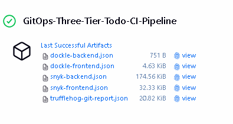
</p>

### Implemented Security Controls

| Security Control        | Implementation                | Status |
| ----------------------- | ----------------------------- | ------ |
| **Secret Management**   | TruffleHog + Git hooks        | ✅     |
| **Dependency Scanning** | Snyk + OWASP Dependency Check | ✅     |
| **Static Analysis**     | SonarQube with Quality Gates  | ✅     |
| **Container Security**  | Dockle + Multi-stage builds   | ✅     |
| **Dynamic Testing**     | OWASP ZAP baseline scan       | ✅     |
| **Access Control**      | Kubernetes RBAC               | ✅     |
| **Network Security**    | AWS Security Groups + ALB     | ✅     |
| **Audit Logging**       | Jenkins build logs            | ✅     |
| **Artifact Signing**    | Nexus repository              | ✅     |

---

## 📸 Application Screenshots

### Pipeline Execution

<p align="center">
    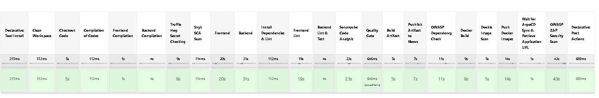
</p>

### Security Scan Results

<table>
  <tr>
    <td align="center">
      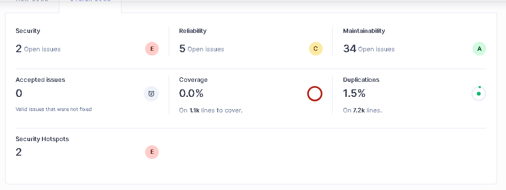
      <br><b>SonarQube SAST Analysis</b>
    </td>
    <td align="center">
      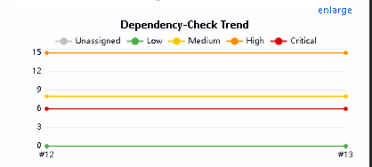
      <br><b>OWASP Dependency Check</b>
    </td>
  </tr>
  <tr>
    <td align="center">
      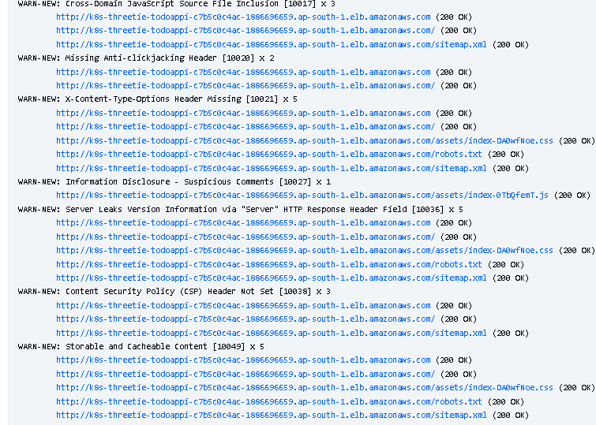
      <br><b>OWASP ZAP DAST Scan</b>
    </td>
    <td align="center">
      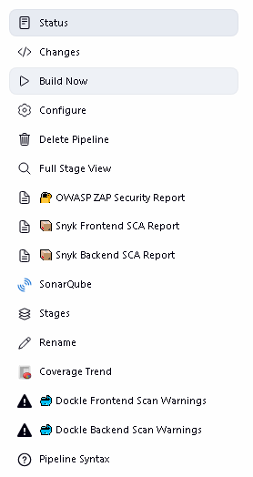
      <br><b>Jenkins Build Artifacts</b>
    </td>
  </tr>
</table>

### Infrastructure & Deployment

<table>
  <tr>
    <td align="center">
      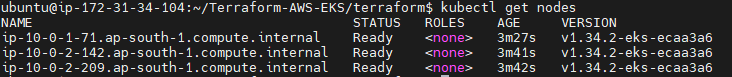
      <br><b>EKS Cluster Nodes</b>
    </td>
    <td align="center">
      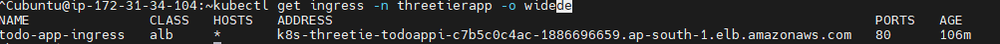
      <br><b>ALB Ingress Controller</b>
    </td>
  </tr>
  <tr>
    <td align="center">
      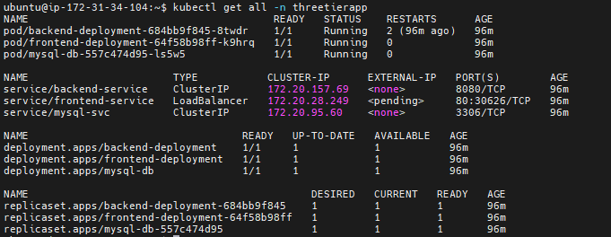
      <br><b>Kubernetes Pods & Services</b>
    </td>
    <td align="center">
      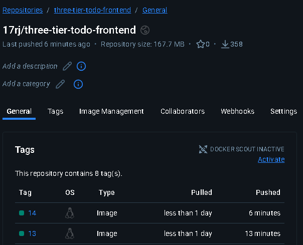
      <br><b>Docker Hub Registry Frontend</b>
    </td>
    <td align="center">
      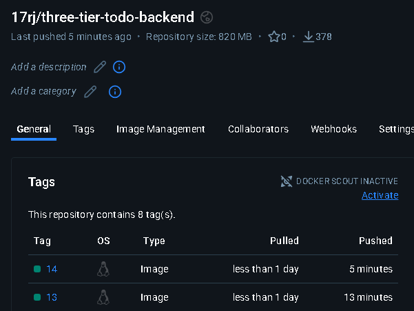
      <br><b>Docker Hub Registry Backend</b>
    </td>
  </tr>
</table>

### ArgoCD GitOps

<table>
  <tr>
    <td align="center">
      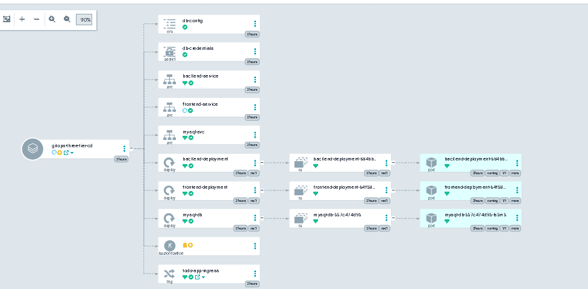
      <br><b>ArgoCD Application Status</b>
    </td>
    <td align="center">
      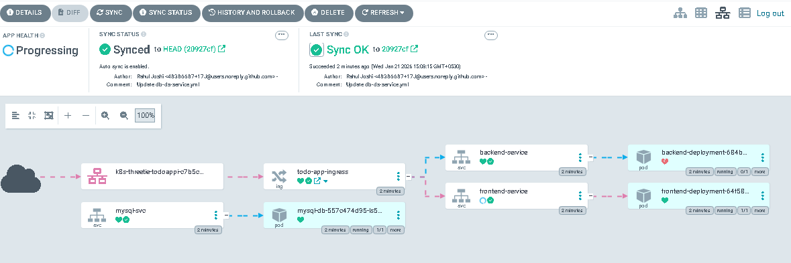
      <br><b>Service Connection Flow</b>
    </td>
  </tr>
  <tr>
    <td align="center">
      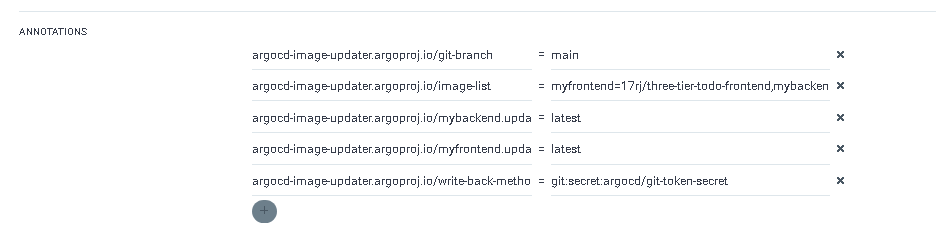
      <br><b>Image Updater Annotations</b>
    </td>
    <td align="center">
      
      <br><b>Deployed Resources</b>
    </td>
  </tr>
</table>

### Artifact Management

<table>
  <tr>
    <td align="center">
      
      <br><b>Nexus Artifact Repository</b>
    </td>
    <td align="center">
      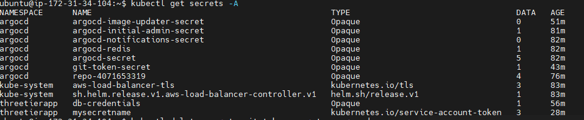
      <br><b>Kubernetes Secrets (EKS)</b>
    </td>
  </tr>
</table>

### Application UI

<table>
  <tr>
    <td align="center">
      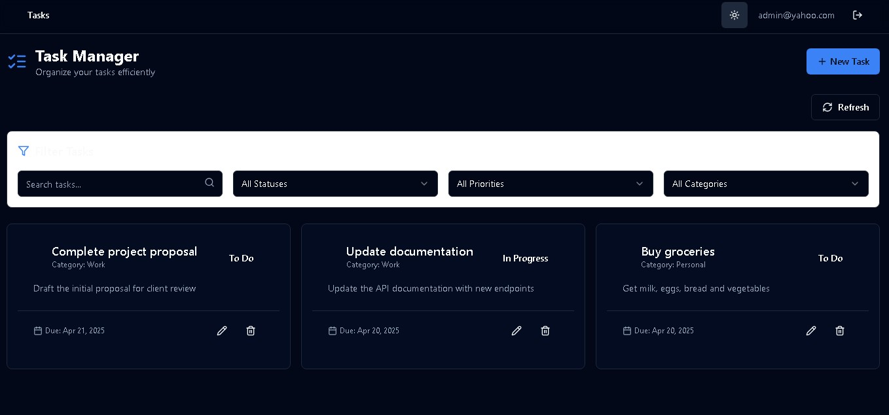
      <br><b>Todo List Dashboard</b>
    </td>
    <td align="center">
      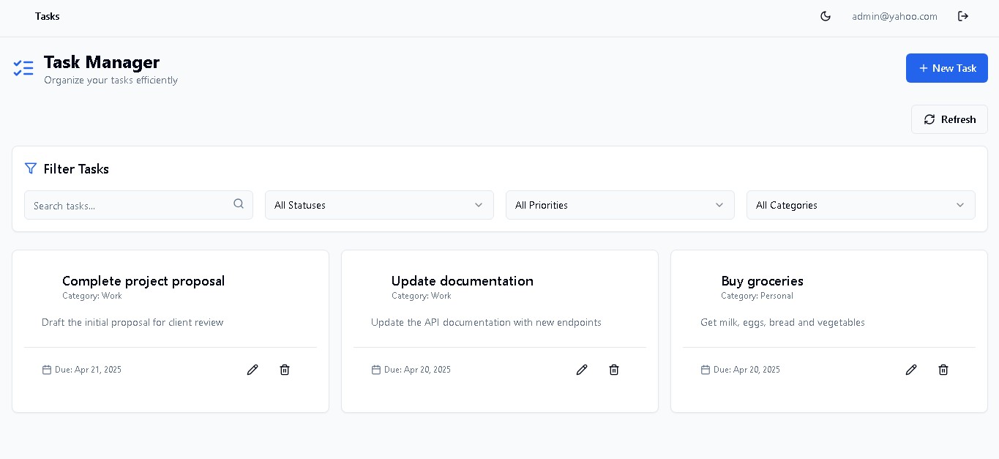
      <br><b> Task Management</b>
    </td>
    <td align="center">
      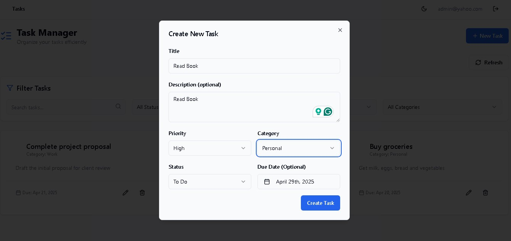
      <br><b>Add New Task</b>
    </td>
  </tr>
</table>

### Application Logs

<p align="center">
    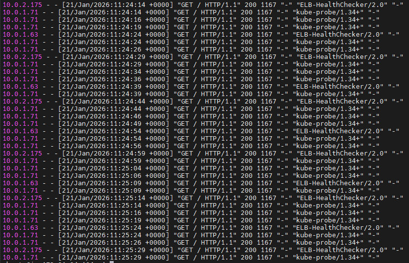
    <br><b>Frontend Pod Logs (Health Checks from ALB & Kubernetes Probes)</b>
</p>

---

## 🔧 Environment Variables

### Jenkins Pipeline Variables

```groovy
environment {
    SCANNER_HOME = tool 'sonar-scanner'
    FRONTEND_IMAGE_NAME = 'three-tier-todo-frontend'
    BACKEND_IMAGE_NAME = 'three-tier-todo-backend'
    IMAGE_TAG = "${env.BUILD_NUMBER}"
    DOCKER_REGISTRY = '17rj'
}
```

### Application Environment Variables

#### Backend (application.properties)

```properties
# Database Configuration
spring.datasource.url=jdbc:mysql://mysql-service:3306/tododb
spring.datasource.username=${DB_USERNAME}
spring.datasource.password=${DB_PASSWORD}
spring.datasource.driver-class-name=com.mysql.cj.jdbc.Driver

# JPA Configuration
spring.jpa.hibernate.ddl-auto=update
spring.jpa.show-sql=true
spring.jpa.properties.hibernate.dialect=org.hibernate.dialect.MySQL8Dialect

# Server Configuration
server.port=8080
```

#### Frontend (Environment)

```bash
REACT_APP_API_URL=/api
NODE_ENV=production
```

#### Kubernetes Secrets (secrets-configmap.yml)

```yaml
apiVersion: v1
kind: Secret
metadata:
  name: mysql-secret
  namespace: threetierapp
type: Opaque
data:
  mysql-root-password: <base64-encoded>
  mysql-user: <base64-encoded>
  mysql-password: <base64-encoded>
```

---

## 🐛 Troubleshooting

### Common Issues & Solutions

#### 1. ALB Controller Not Creating Load Balancer

**Symptoms:**

```bash
kubectl get ingress -n threetierapp
# Shows: ADDRESS field is empty
```

**Solution:**

```bash
# Check ALB controller logs
kubectl logs -n kube-system deployment/aws-load-balancer-controller

# Common issues:
# - IAM permissions missing
# - Subnets not properly tagged
# - Security groups misconfigured

# Tag subnets for ALB
aws ec2 create-tags --resources subnet-xxxxx \
  --tags Key=kubernetes.io/role/elb,Value=1

# For private subnets:
aws ec2 create-tags --resources subnet-yyyyy \
  --tags Key=kubernetes.io/role/internal-elb,Value=1

# Verify security groups allow traffic
kubectl describe ingress todo-app-ingress -n threetierapp
```

#### 2. Jenkins Pipeline Fails at SonarQube Stage

**Symptoms:**

```
ERROR: SonarQube server unreachable
```

**Solution:**

```bash
# Verify SonarQube connection
curl http://your-sonarqube:9000/api/system/status

# Check Jenkins configuration
# Manage Jenkins → Configure System → SonarQube servers

# Test token
curl -u <token>: http://your-sonarqube:9000/api/authentication/validate

# If token expired, generate new:
# SonarQube → My Account → Security → Generate Tokens
```

#### 3. Docker Push Fails - Unauthorized

**Symptoms:**

```
Error response from daemon: unauthorized: authentication required
```

**Solution:**

```bash
# Verify credentials in Jenkins
# Manage Jenkins → Credentials → docker-cred

# Test Docker login manually on Jenkins server
docker login -u 17rj -p <password>

# Check credential ID in Jenkinsfile matches
withCredentials([usernamePassword(credentialsId: 'docker-cred', ...)])
```

#### 4. ArgoCD Image Updater Not Working

**Symptoms:**

```bash
kubectl logs -n argocd -l app.kubernetes.io/name=argocd-image-updater
# Shows: skipping app 'gitops-three-tier-cd' of type 'Directory'
```

**Solution:**

```bash
# 1. Ensure kustomization.yaml exists in CD repo
cat Three-Tier-Todo-App-CD/kustomization.yaml

# 2. Update ArgoCD application to use Kustomize
kubectl patch application gitops-three-tier-cd -n argocd \
  --type merge -p '{"spec":{"source":{"kustomize":{}}}}'

# 3. Verify annotations
kubectl get application gitops-three-tier-cd -n argocd -o yaml

# 4. Check secret exists
kubectl get secret git-token-secret -n argocd

# 5. Test GitHub token
curl -H "Authorization: token <YOUR_PAT>" \
  https://api.github.com/user
```

#### 5. Pods CrashLoopBackOff

**Symptoms:**

```bash
kubectl get pods -n threetierapp
# Shows: CrashLoopBackOff status
```

**Solution:**

```bash
# Check pod logs
kubectl logs <pod-name> -n threetierapp

# Describe pod for events
kubectl describe pod <pod-name> -n threetierapp

# Common issues:
# - Missing environment variables
# - Database connection issues
# - Resource limits too low

# Check secrets
kubectl get secrets -n threetierapp

# Verify ConfigMaps
kubectl get configmap -n threetierapp

# Check resource limits
kubectl describe deployment <deployment-name> -n threetierapp
```

#### 6. OWASP ZAP Stage Timeout

**Symptoms:**

```
Timeout waiting for ALB URL
```

**Solution:**

```bash
# Check ingress status
kubectl get ingress todo-app-ingress -n threetierapp -o yaml

# Verify ALB is provisioning
aws elbv2 describe-load-balancers --region ap-south-1

# Check ALB controller logs
kubectl logs -n kube-system deployment/aws-load-balancer-controller

# Manually get ALB URL
kubectl get ingress todo-app-ingress -n threetierapp \
  -o jsonpath='{.status.loadBalancer.ingress[0].hostname}'

# Test ALB accessibility
curl http://<alb-url>
```

#### 7. Nexus Upload Fails

**Symptoms:**

```
Return code is: 401, ReasonPhrase: Unauthorized
```

**Solution:**

```bash
# Verify Maven settings.xml in Jenkins
# Config File Provider → nexus-settings

# Ensure settings.xml contains correct credentials
<servers>
  <server>
    <id>nexus</id>
    <username>admin</username>
    <password>your-password</password>
  </server>
</servers>

# Test Nexus connection
curl -u admin:password http://your-nexus:8081/service/rest/v1/status

# Verify repository exists
# Nexus UI → Repositories → maven-releases
```

#### 8. kubectl Connection Issues

**Symptoms:**

```
ERROR: Unable to connect to the server
```

**Solution:**

```bash
# Verify kubeconfig in Jenkins
# Credentials → kube-cred → Update File

# Test kubectl from Jenkins server
kubectl get nodes --kubeconfig=/path/to/config

# Update kubeconfig
aws eks update-kubeconfig --region ap-south-1 --name expdevops-cluster

# Check cluster endpoint
kubectl cluster-info

# Verify IAM permissions
aws sts get-caller-identity
```

### Debug Commands

```bash
# Check all resources in namespace
kubectl get all -n threetierapp

# Get detailed pod information
kubectl describe pod <pod-name> -n threetierapp

# View pod logs
kubectl logs <pod-name> -n threetierapp --tail=100 -f

# Execute commands inside pod
kubectl exec -it <pod-name> -n threetierapp -- /bin/bash

# Check service endpoints
kubectl get endpoints -n threetierapp

# View ingress details
kubectl describe ingress todo-app-ingress -n threetierapp

# Check events
kubectl get events -n threetierapp --sort-by='.lastTimestamp'

# Test service connectivity
kubectl run test-pod --image=busybox -it --rm -n threetierapp -- sh
# Inside pod:
wget -O- http://backend-service:8080/api/todos

# Check ArgoCD application status
kubectl get application -n argocd gitops-three-tier-cd -o yaml

# View ArgoCD sync status
argocd app get gitops-three-tier-cd

# Check Image Updater logs
kubectl logs -n argocd -l app.kubernetes.io/name=argocd-image-updater --tail=100
```

---

## 🤝 Contributing

Contributions are welcome! Here's how you can help:

### How to Contribute

1. **Fork the Repository**

   ```bash
   git clone https://github.com/17J/Three-Tier-Todo-App-CI.git
   ```

2. **Create a Feature Branch**

   ```bash
   git checkout -b feature/AmazingFeature
   ```

3. **Make Your Changes**
   - Follow existing code style
   - Add tests if applicable
   - Update documentation

4. **Commit Your Changes**

   ```bash
   git commit -m 'Add some AmazingFeature'
   ```

5. **Push to the Branch**

   ```bash
   git push origin feature/AmazingFeature
   ```

6. **Open a Pull Request**
   - Provide clear description of changes
   - Reference any related issues
   - Wait for review

### Code of Conduct

- Be respectful and inclusive
- Follow best practices
- Document your changes
- Test thoroughly before submitting

---

## 📄 License

This project is licensed under the **MIT License** - see the [LICENSE](LICENSE) file for details.

```
MIT License

Copyright (c) 2026 Rahul Joshi

Permission is hereby granted, free of charge, to any person obtaining a copy
of this software and associated documentation files (the "Software"), to deal
in the Software without restriction, including without limitation the rights
to use, copy, modify, merge, publish, distribute, sublicense, and/or sell
copies of the Software, and to permit persons to whom the Software is
furnished to do so, subject to the following conditions:

The above copyright notice and this permission notice shall be included in all
copies or substantial portions of the Software.

THE SOFTWARE IS PROVIDED "AS IS", WITHOUT WARRANTY OF ANY KIND, EXPRESS OR
IMPLIED, INCLUDING BUT NOT LIMITED TO THE WARRANTIES OF MERCHANTABILITY,
FITNESS FOR A PARTICULAR PURPOSE AND NONINFRINGEMENT. IN NO EVENT SHALL THE
AUTHORS OR COPYRIGHT HOLDERS BE LIABLE FOR ANY CLAIM, DAMAGES OR OTHER
LIABILITY, WHETHER IN AN ACTION OF CONTRACT, TORT OR OTHERWISE, ARISING FROM,
OUT OF OR IN CONNECTION WITH THE SOFTWARE OR THE USE OR OTHER DEALINGS IN THE
SOFTWARE.
```

---

## 👨‍💻 Author

<div align="center">

**Rahul Joshi**

[](mailto:17rahuljoshi@gmail.com)
[](https://github.com/17J)

</div>

---

## 🙏 Acknowledgments

- **AWS** for EKS and cloud infrastructure
- **CNCF** for Kubernetes ecosystem
- **ArgoCD Team** for GitOps tooling
- **Jenkins Community** for CI/CD platform
- **OWASP** for security testing tools
- **Open Source Community** for amazing tools

---

## ⭐ Show Your Support

If this project helped you learn DevSecOps practices, please give it a ⭐!

<div align="center">

**⭐ Star this repo | 🍴 Fork it | 📢 Share it**

</div>

---

## 📝 Changelog

### [1.0.0] - 2026-01-21

#### Added

- Complete 23-stage CI/CD pipeline
- Multiple security scanning tools integration
- ArgoCD GitOps deployment
- AWS EKS with ALB Ingress Controller
- Comprehensive documentation
- Screenshot gallery

#### Security

- TruffleHog secret scanning
- Snyk dependency scanning
- SonarQube code analysis
- OWASP dependency check
- Dockle container scanning
- OWASP ZAP DAST testing

---

<div align="center">

### 🎯 Project Status: Production Ready ✅

**Built with ❤️ for the DevSecOps Community**

---

**If you found this helpful, consider:**

- ⭐ Starring the repository
- 🐛 Reporting issues
- 💡 Suggesting improvements
- 🤝 Contributing code

---

[]()
[]()
[]()

</div>
